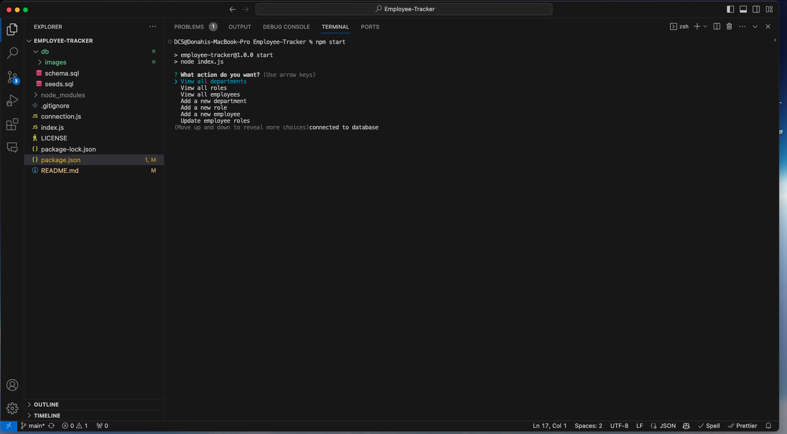
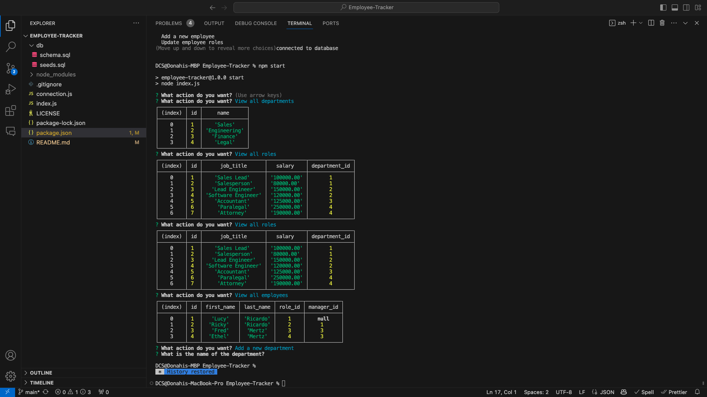

## EMPLOYEE TRACKER

### Table of Contents
1. [Description](#description)
2. [Installation](#installation)
3. [Technologies](#technologies) 
4. [Usage](#usage)
5. [Contributing](#contributing)
6. [Collaborators](#collaborators)
7. [Questions](#questions)
8. [License](#license)

### Description
This Employee Tracker is a command-line application that allows the user to view and manage the departments, roles, and employees in their company. The user is able to add departments, roles, and employees, view departments, roles, and employees, and update employee roles. This application uses node, inquirer, and MySQL.

### Installation
To install the Employee Tracker, follow these steps:
 1. Clone the GitHub repository: `git clone git@github.com:Augustus1110/Employee-Tracker.git`
 2. Navigate to the project's directory: `cd Employee-Tracker`
 3. Install the required npm packages: `npm install`

### Technologies
This project was built using:
- Node.js
- Inquirer
- MySQL
- JavaScript

### Usage
To use the Employee Tracker, follow these steps:
    1. Navigate to the project's directory: `cd Employee-Tracker`
    2. Run the application: `node index.js`
    3. Follow the prompts to view and manage the departments, roles, and employees in your company.
 

### Images

### Contributing
Contributions to the README Generator are welcome. To contribute, please follow these guidelines:
 1. Fork the repository.
 2. Create a new branch.
 3. Make your changes and commit them.
 4. Push your changes to your forked repository.
 5. Submit a pull request detailing your changes.

### Collaborators
This project was completed with guidance and assistance from EdX/UC Berkeley Extension tutor Robby Kurle.

### Questions
If you have any questions, please contact me:

- GitHub: [Augustus1110](https://github.com/Augustus1110)
- Email: donahi22@gmail.com

## License
MIT
(https://opensource.org/licenses/MIT)

## Video Walkthrough
(https://drive.google.com/file/d/1Si_IaKimX9zyX1MNzKnqmEXHQwU88Lui/view)
